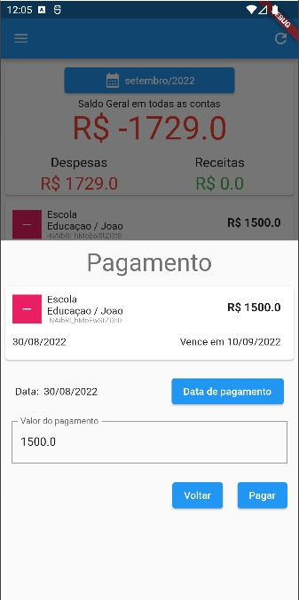

# Fin - Personal finances

This app allow you to control your personal finances by registering your earns and expenses.

The app works as a test bench for tecniches and resouces of Fluuter and Realtime database (Firebase). 

## Customized components
- Textfield
- Dialog
- Snackbar/Toast
- DropBox

## Main classes
- Message exchange
- Guid generator
- Scaffold
- Modal Form

## A few images

<table>
<tr>
<td>

</td>
<td>
 
</td>
<td>

</td>
</tr>
</table>

## Next steps
- Correction of Minor bugs on refresh in main screen
- Installment bills
- Local cache data so the app could work offline
- Custom theme
